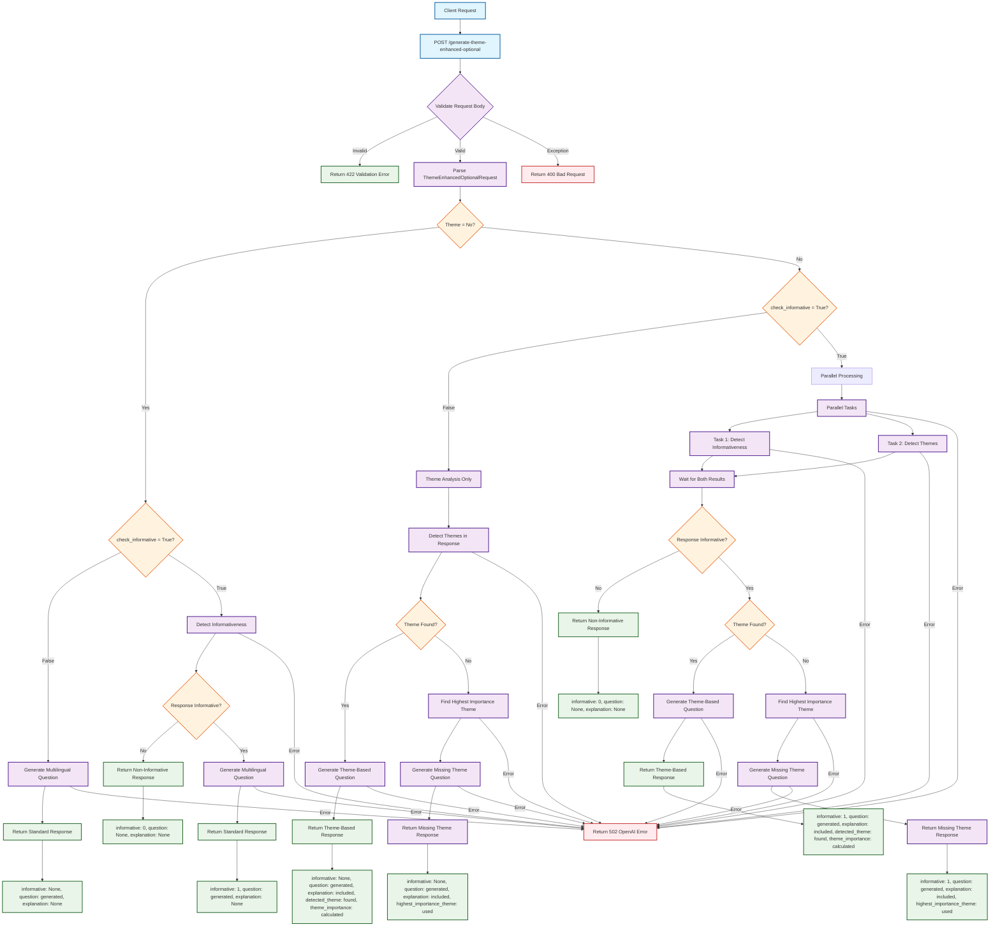

# Theme Enhanced Optional API Flowchart

This Mermaid diagram illustrates the complete flow of the `/generate-theme-enhanced-optional` API endpoint, showing all decision points, processing paths, and response generation.



## Key Features of the Flow

### 1. **Request Validation**
- Validates `ThemeEnhancedOptionalRequest` model
- Checks required fields: `question`, `response`, `type`, `language`, `theme`, `check_informative`
- Validates `theme_parameters` when `theme="Yes"`

### 2. **Three Main Processing Paths**

#### **Standard Workflow** (`theme="No"`)
- Respects `check_informative` parameter
- Performs informativeness detection when `check_informative=true`
- Skips theme analysis (no theme parameters needed)
- Returns multilingual question with appropriate informative status

#### **Theme Analysis Only** (`check_informative=False`)
- Performs theme detection without informativeness check
- Generates theme-based or missing theme questions
- Sets `informative: None` in response

#### **Full Processing** (`check_informative=True`)
- Parallel processing of informativeness detection and theme analysis
- Early return for non-informative responses
- Generates appropriate questions based on theme detection results

### 3. **Theme Detection Logic**
- **Flexible Matching**: Exact words, partial matches, semantic relationships
- **Fallback String Matching**: Enhanced with semantic word mappings
- **Importance Ranking**: Uses theme importance percentages for decision making

### 4. **Response Generation**
- **Theme-Based Questions**: When themes are detected in the response
- **Missing Theme Questions**: When no themes are found, asks about highest importance theme
- **Standard Questions**: When theme analysis is disabled

### 5. **Error Handling**
- **Validation Errors**: 422 for invalid request data
- **Bad Request**: 400 for malformed requests
- **OpenAI Errors**: 502 for API service failures
- **Internal Errors**: 500 for unexpected server errors

### 6. **Performance Optimizations**
- **Parallel Processing**: Concurrent informativeness and theme detection
- **Caching**: Response caching for repeated requests
- **Connection Pooling**: Optimized HTTP session management
- **Fast Path**: Direct route for standard workflow

## Request/Response Examples

### Request Body
```json
{
  "question": "What is your experience with teamwork?",
  "response": "I enjoy working together with colleagues on projects.",
  "type": "reason",
  "language": "English",
  "theme": "Yes",
  "check_informative": false,
  "theme_parameters": {
    "themes": [
      {"name": "collaboration", "importance": 80},
      {"name": "communication", "importance": 60}
    ]
  }
}
```

### Response Body
```json
{
  "informative": null,
  "question": "What specific aspects of working together do you find most rewarding?",
  "explanation": "Generated a reason-based question focusing on the detected 'collaboration' theme...",
  "original_question": "What is your experience with teamwork?",
  "original_response": "I enjoy working together with colleagues on projects.",
  "type": "reason",
  "language": "English",
  "theme": "Yes",
  "check_informative": false,
  "detected_theme": "collaboration",
  "theme_importance": 80,
  "highest_importance_theme": null
}
``` 