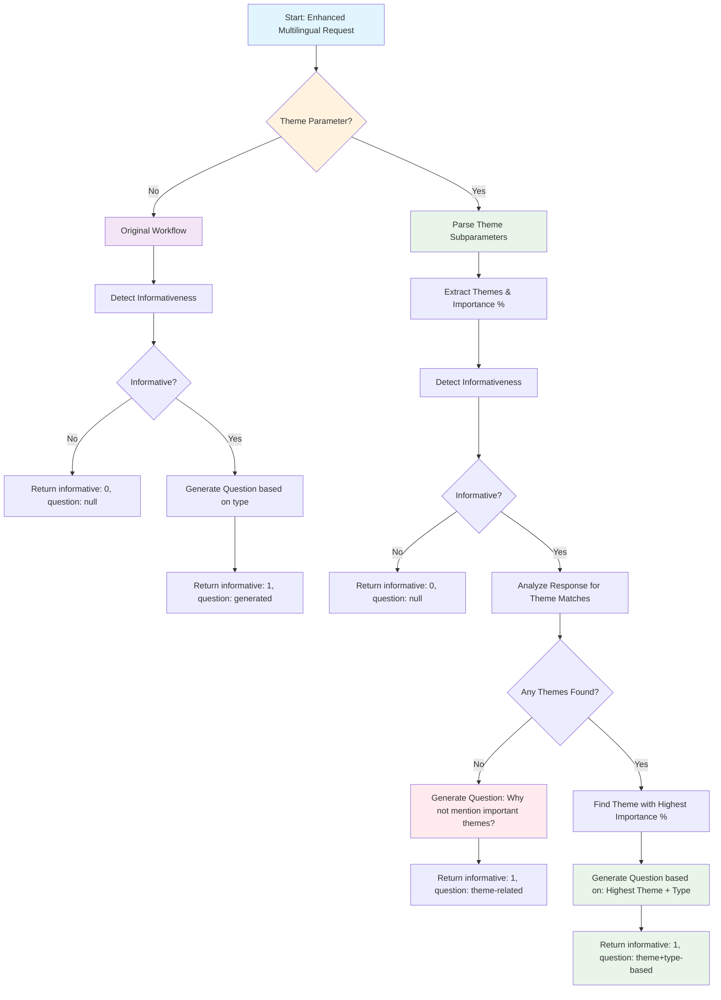

# Theme Enhancement Flowchart



## Request Structure

### When Theme = "No"
```json
{
  "question": "What challenges do you face at work?",
  "response": "I struggle with time management.",
  "type": "reason",
  "language": "English",
  "theme": "No"
}
```

### When Theme = "Yes"
```json
{
  "question": "What challenges do you face at work?",
  "response": "I struggle with time management and communication.",
  "type": "reason",
  "language": "English",
  "theme": "Yes",
  "theme_parameters": {
    "themes": [
      {"name": "leadership", "importance": 80},
      {"name": "communication", "importance": 60},
      {"name": "technology", "importance": 40}
    ]
  }
}
```

## Response Examples

### Scenario 1: Theme = "No"
```json
{
  "informative": 1,
  "question": "Why do you struggle with time management?",
  "original_question": "What challenges do you face at work?",
  "original_response": "I struggle with time management.",
  "type": "reason",
  "language": "English",
  "theme": "No"
}
```

### Scenario 2: Theme = "Yes", Theme Found
```json
{
  "informative": 1,
  "question": "How does your communication challenge affect team collaboration?",
  "original_question": "What challenges do you face at work?",
  "original_response": "I struggle with time management and communication.",
  "type": "reason",
  "language": "English",
  "theme": "Yes",
  "detected_theme": "communication",
  "theme_importance": 60
}
```

### Scenario 3: Theme = "Yes", No Theme Found
```json
{
  "informative": 1,
  "question": "Why do you think leadership skills weren't mentioned in your response?",
  "original_question": "What challenges do you face at work?",
  "original_response": "I struggle with time management.",
  "type": "reason",
  "language": "English",
  "theme": "Yes",
  "detected_theme": null,
  "highest_importance_theme": "leadership"
}
``` 